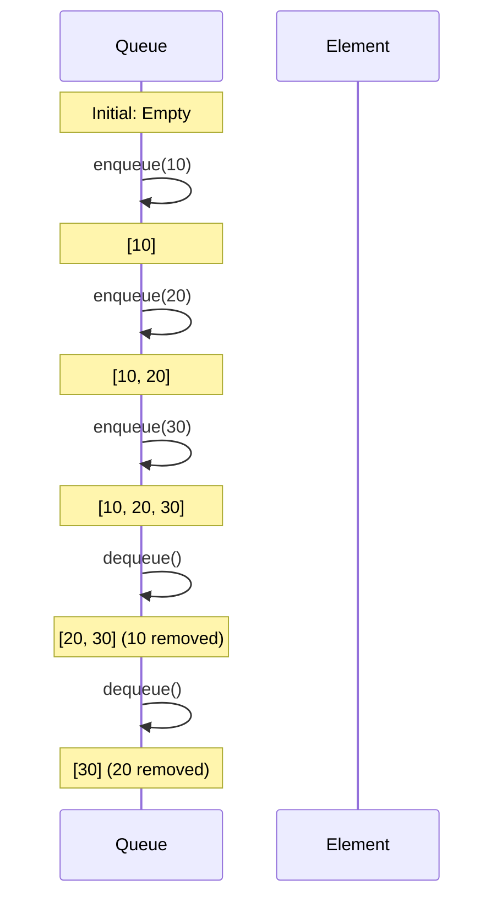
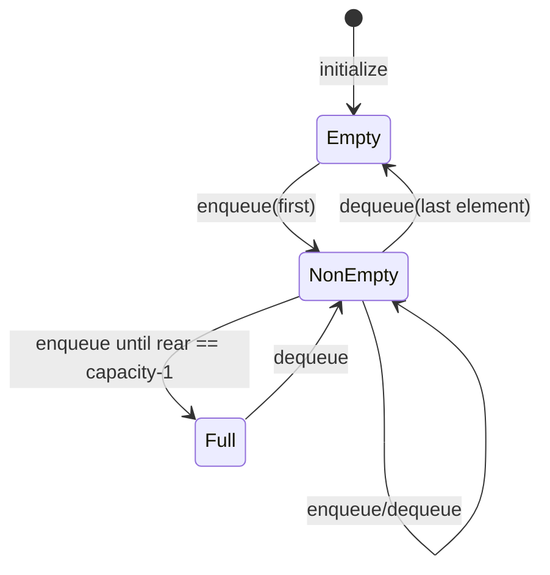
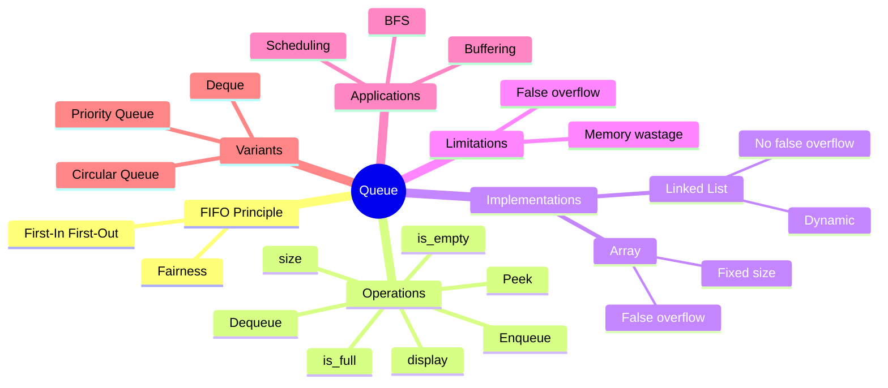
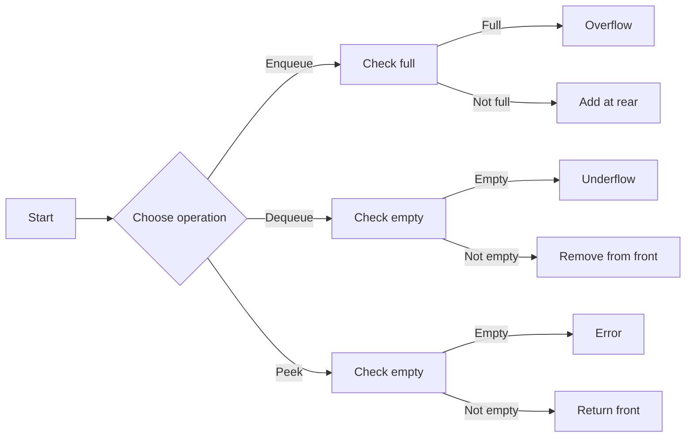

# Simple Queue (Linear Queue) – A Comprehensive Textbook Chapter

---

## 1. Introduction

### What is a Queue?

Imagine you’re standing in line at a grocery store. The first person to arrive gets served first, and new customers join at the end of the line. This is a **queue**—a collection where the **first item added is the first one removed**. In computer science, this is called **FIFO** (First-In, First-Out).

A queue is a linear data structure that stores elements in a sequential order. It has two main ends: the **front** (where elements are removed) and the **rear** (where elements are added). Operations are restricted to these two ends only.

### Why Should We Learn It?

Queues are everywhere in computing:
- **Operating systems** use queues to schedule processes.
- **Network routers** queue packets before forwarding.
- **Printers** manage print jobs in a queue.
- **Web servers** handle incoming requests in a queue.
- **Everyday apps** like Uber, food delivery, and ticket booking use queues to manage orders.

Understanding queues is fundamental to becoming a proficient programmer and system designer. It teaches you how to manage data flows, handle asynchronous tasks, and design fair systems.

### Where is it Used?

| Application Area | Example |
|------------------|---------|
| **CPU Scheduling** | Round-robin scheduler |
| **Network Buffers** | Packet queue in routers |
| **Print Spooling** | Print job queue |
| **Message Queues** | RabbitMQ, Kafka |
| **Graph Algorithms** | Breadth-First Search (BFS) |
| **Producer-Consumer** | Task queues, event loops |
| **Simulation Systems** | Customer service lines |

---

## 2. Why Queue Exists

### Historical Motivation

Before queues were formalized, systems handled requests sequentially without any fairness. In early batch processing systems, jobs were executed one after another, but if a job took a long time, all subsequent jobs starved. This was inefficient and unfair.

The need for **fair ordering** and **buffer management** led to the creation of queues. The concept of a waiting line was borrowed from everyday life to manage resource sharing among multiple consumers.

### Real-World Problem

Consider a single printer shared by many users. If everyone sends print jobs at the same time, the printer must process them in some order. Without a queue, jobs might be lost or processed haphazardly. A queue ensures that jobs are printed in the order they were received, so that no one is unfairly delayed.

### FIFO Philosophy

**FIFO (First-In, First-Out)** is a natural ordering principle: the first to arrive is the first to be served. It is simple, fair, and easy to implement. It mirrors the way we naturally form lines in real life.

### Evolution of Queues

- **Ancient times**: People formed lines for goods and services.
- **Early computing**: Batch processing with ordered job lists.
- **1960s**: Operating systems introduced job queues for multiprogramming.
- **1970s**: Network protocols used queues for packet buffering.
- **1980s–present**: Queues became ubiquitous in software systems, with advanced variants like circular queues, priority queues, and double-ended queues (deques).

---

## 3. Problems Queue Solves

Let’s tell a story for each problem.

### Story 1: The Waiting Line (Ticket Counter)

**Problem**: Many people want to buy tickets at a counter. If they rush to the clerk simultaneously, chaos ensues.

**Solution**: Organize them in a single line. The clerk serves the person at the front; new arrivals join at the back.

**Queue mapping**: `enqueue` adds a person to the rear; `dequeue` removes from the front. FIFO ensures fairness.

### Story 2: Printer Sharing

**Problem**: Multiple users send documents to a shared printer. If the printer picks randomly, some users may wait indefinitely.

**Solution**: Print jobs are stored in a queue. The printer prints the first job received, then the next, and so on.

**Queue mapping**: Jobs are enqueued; printer dequeues one at a time.

### Story 3: CPU Scheduler

**Problem**: In an operating system, many processes compete for the CPU. If one process runs forever, others starve.

**Solution**: Use a ready queue of processes. The scheduler picks the first process in the queue, gives it a time slice, and moves it to the back if it still needs more CPU time (round-robin).

**Queue mapping**: Processes are enqueued when ready; scheduler dequeues the front process.

### Story 4: Customer Support Call Center

**Problem**: Customers call a support line. If all agents are busy, calls must wait.

**Solution**: Calls are placed in a queue (waiting line). Agents pick the next call from the front when free.

**Queue mapping**: Each call is enqueued; agents dequeue calls.

### Story 5: Order Processing in E-commerce

**Problem**: An online store receives thousands of orders per minute. Processing orders in any random order may cause confusion.

**Solution**: Orders are queued in the order they arrive. The system processes them sequentially.

**Queue mapping**: Orders enqueued; processing system dequeues.

---

## 4. History

### Mathematical Origin

The mathematical study of queues originated in the early 20th century with **Agner Krarup Erlang**, a Danish engineer who worked on telephone traffic. He developed the **Erlang distribution** to model the number of calls waiting in a telephone exchange. This laid the foundation for queueing theory.

### Computer Science Evolution

- **1960s**: With the advent of multiprogramming, operating systems required scheduling algorithms. The **job queue** and **ready queue** became standard.
- **1970s**: **Dijkstra** introduced the producer-consumer problem, which uses a bounded buffer (a queue) to synchronize processes.
- **1980s**: Networking protocols like TCP used queues for packet buffering.
- **1990s**: Object-oriented languages provided built-in queue classes.
- **2000s–present**: Queues evolved into distributed message queues (e.g., Kafka, RabbitMQ) for microservices and big data.

### Operating Systems

In OS, queues manage:
- **Ready queue**: processes waiting for CPU.
- **Device queues**: processes waiting for I/O.
- **Job queue**: processes waiting for admission.

### Networking

Routers and switches use queues to buffer packets when the output link is busy. Queue management algorithms like **FIFO**, **RED** (Random Early Detection), and **WRED** are critical for network performance.

---

## 5. Real-Life Analogies

Each analogy demonstrates the core FIFO principle.

### 1. Ticket Counter

- **Problem**: Many customers want to buy tickets.
- **Solution**: Customers form a line; the clerk serves the front person.
- **Queue mapping**: `enqueue` = join line, `dequeue` = get served.

### 2. ATM Queue

- **Problem**: People using a single ATM.
- **Solution**: Line up; the first person uses the ATM, then leaves; next person steps up.
- **Queue mapping**: Arrivals are enqueued; ATM dequeues.

### 3. Printer Queue

- **Problem**: Multiple users send documents to one printer.
- **Solution**: Printer processes jobs in arrival order.
- **Queue mapping**: Documents enqueued; printer dequeues.

### 4. Restaurant Waitlist

- **Problem**: Many parties waiting for tables.
- **Solution**: Hostess maintains a list; when a table frees, the first party is seated.
- **Queue mapping**: Parties enqueued; hostess dequeues when table available.

### 5. Hospital Emergency Triage

- **Problem**: Patients arrive at ER. Some are more critical, but for non-critical, FIFO is used.
- **Solution**: A queue of patients (priority may override, but general queue still applies).
- **Queue mapping**: Patients enqueued; doctor dequeues.

### 6. Airport Security Check

- **Problem**: Passengers need to go through security.
- **Solution**: They line up; the first in line goes through the scanner.
- **Queue mapping**: Passengers enqueued; security dequeues.

### 7. Grocery Billing

- **Problem**: Many customers at checkout.
- **Solution**: Customers line up; cashier serves first.
- **Queue mapping**: Customers enqueued; cashier dequeues.

### 8. Toll Plaza

- **Problem**: Vehicles arrive at a toll booth.
- **Solution**: Vehicles line up; the first in line pays and goes.
- **Queue mapping**: Vehicles enqueued; toll operator dequeues.

### 9. Call Center

- **Problem**: Many callers waiting for an agent.
- **Solution**: Calls are placed in a queue; agents take the next call.
- **Queue mapping**: Calls enqueued; agents dequeue.

### 10. Food Delivery

- **Problem**: Orders placed online need to be processed by the kitchen.
- **Solution**: Orders are queued; kitchen prepares the oldest order first.
- **Queue mapping**: Orders enqueued; kitchen dequeues.

---

## 6. FIFO Principle – Deep Dive

### What is FIFO?

FIFO stands for **First-In, First-Out**. It means the element that has been in the queue the longest is removed first.

### Visual Representation

**ASCII Diagram of a Queue with Elements [10, 20, 30, 40]**:

```text
Front                    Rear
  ↓                       ↓
+----+----+----+----+
| 10 | 20 | 30 | 40 |
+----+----+----+----+
```

- `Front` points to the first element (10).
- `Rear` points to the last element (40).

### Mermaid Sequence Diagram for Enqueue and Dequeue



### FIFO Step-by-Step Table

| Step | Operation | Queue State | Front | Rear |
|------|-----------|-------------|-------|------|
| 0 | Initial | Empty | -1 | -1 |
| 1 | enqueue(10) | [10] | 0 | 0 |
| 2 | enqueue(20) | [10, 20] | 0 | 1 |
| 3 | enqueue(30) | [10, 20, 30] | 0 | 2 |
| 4 | dequeue() | [20, 30] | 1 | 2 |
| 5 | dequeue() | [30] | 2 | 2 |
| 6 | enqueue(40) | [30, 40] | 2 | 3 |

### Why FIFO?

- **Fairness**: No element gets preferential treatment.
- **Predictability**: The order of processing is deterministic.
- **Simplicity**: Easy to implement and reason about.

---

## 7. Memory Representation of a Linear Queue

We'll use an array-based representation. The array has a fixed size `capacity`. We maintain two integer indices: `front` and `rear`.

- `front` indicates the index of the first element.
- `rear` indicates the index of the last element.
- Initially, `front = -1` and `rear = -1` (empty queue).

### Empty Queue

```text
Array indices:   0   1   2   3   4
Values:        [   ] [   ] [   ] [   ] [   ]
front = -1, rear = -1
```

### Queue with One Element (10)

```text
front = 0, rear = 0
+----+----+----+----+----+
| 10 |    |    |    |    |
+----+----+----+----+----+
  ↑
front/rear
```

### Queue with Multiple Elements (10, 20, 30)

```text
front = 0, rear = 2
+----+----+----+----+----+
| 10 | 20 | 30 |    |    |
+----+----+----+----+----+
  ↑               ↑
front            rear
```

### Full Queue (capacity 5)

```text
front = 0, rear = 4
+----+----+----+----+----+
| 10 | 20 | 30 | 40 | 50 |
+----+----+----+----+----+
  ↑                   ↑
front                rear
```

### After Dequeuing Some Elements (10, 20 removed)

```text
front = 2, rear = 4
+----+----+----+----+----+
|    |    | 30 | 40 | 50 |
+----+----+----+----+----+
          ↑         ↑
        front      rear
```

Notice that the front index moves forward. The cells before `front` are **unused** and cannot be reused in a linear queue (leading to **false overflow**, discussed later).

### Mermaid State Diagram for Queue States



---

## 8. Operations on a Queue

We will cover each operation in detail.

### 8.1 Create Queue (Initialization)

#### Problem
We need to create an empty queue with a specified capacity.

#### Why this operation exists
To set up the data structure before any operations.

#### Intuition
Reserve memory for the array and set `front = rear = -1`.

#### Visualization
```text
Array: [ , , , , ]
front = -1, rear = -1
```

#### Pseudo Code
```
class Queue:
    constructor(capacity):
        this.capacity = capacity
        this.arr = new array[capacity]
        this.front = -1
        this.rear = -1
```

#### Algorithm
1. Allocate an array of given size.
2. Initialize `front` and `rear` to -1.

#### Python Implementation
```python
from typing import Optional, List

class Queue:
    """A simple linear queue implemented using an array."""
    
    def __init__(self, capacity: int):
        """
        Initialize the queue with a given capacity.
        
        Args:
            capacity: Maximum number of elements the queue can hold.
        """
        if capacity <= 0:
            raise ValueError("Capacity must be positive")
        self.capacity: int = capacity
        self.arr: List[Optional[int]] = [None] * capacity
        self.front: int = -1
        self.rear: int = -1
```

#### Driver Code
```python
q = Queue(5)
print(q.capacity)  # 5
print(q.front)     # -1
print(q.rear)      # -1
```

#### Output Explanation
- `capacity` is set to 5.
- `front` and `rear` are -1, indicating empty.

#### Complexity
- Time: O(1)
- Space: O(capacity)

---

### 8.2 isEmpty()

#### Problem
Check whether the queue has no elements.

#### Why this operation exists
To avoid performing operations (like dequeue) on an empty queue, which would cause errors.

#### Intuition
If `front` is -1, the queue is empty.

#### Visualization
- If `front == -1` → empty.

#### ASCII
```text
front = -1, rear = -1
[ ] [ ] [ ] [ ] [ ]
```

#### Pseudo Code
```
isEmpty():
    return front == -1
```

#### Algorithm
1. Return `True` if `front` is -1, else `False`.

#### Python Implementation
```python
def is_empty(self) -> bool:
    """Check if the queue is empty."""
    return self.front == -1
```

#### Driver Code
```python
q = Queue(5)
print(q.is_empty())  # True
q.enqueue(10)
print(q.is_empty())  # False
```

#### Output
```
True
False
```

#### Complexity
- Time: O(1)
- Space: O(1)

#### Edge Cases
- Works even if `front` is -1 but `rear` is not -1 (should never happen in a valid queue).

#### Common Mistakes
- Using `rear == -1` to check emptiness; use `front` instead.

---

### 8.3 isFull()

#### Problem
Check whether the queue has reached its maximum capacity.

#### Why this operation exists
To prevent overflow when trying to enqueue more elements than the array can hold.

#### Intuition
In a linear queue, the queue is full when `rear == capacity - 1`.

#### Visualization
```text
Capacity = 5
front = 0, rear = 4
[10][20][30][40][50]
```
`rear` is at last index, so full.

#### ASCII
```text
front=0, rear=4 (capacity-1)
+----+----+----+----+----+
| 10 | 20 | 30 | 40 | 50 |
+----+----+----+----+----+
```

#### Pseudo Code
```
isFull():
    return rear == capacity - 1
```

#### Algorithm
1. Return `True` if `rear` equals `capacity - 1`, else `False`.

#### Python Implementation
```python
def is_full(self) -> bool:
    """Check if the queue is full."""
    return self.rear == self.capacity - 1
```

#### Driver Code
```python
q = Queue(3)
q.enqueue(10)
q.enqueue(20)
q.enqueue(30)
print(q.is_full())  # True
q.dequeue()
print(q.is_full())  # False (rear still 2, but front moved; but linear queue doesn't reuse space)
```

#### Output
```
True
False
```

#### Explanation
After dequeue, rear remains 2, so `is_full()` still returns `True` if we check only `rear == capacity-1`. However, there is actually space at the front; but in a linear queue, we cannot reuse that space, so the queue is considered full (false overflow). This is a limitation we'll discuss later.

#### Complexity
- Time: O(1)
- Space: O(1)

#### Edge Cases
- When queue is empty, `rear` is -1, so `is_full()` returns `False`.

---

### 8.4 Enqueue (Add Element)

#### Problem
Add an element to the rear of the queue.

#### Why this operation exists
To insert new data into the queue.

#### Intuition
- If queue is empty, set both `front` and `rear` to 0.
- Else, increment `rear` and place the element at that index.
- If queue is full, raise overflow error.

#### Visualization (ASCII)

**Before enqueue (empty):**
```text
front = -1, rear = -1
[ ] [ ] [ ] [ ] [ ]
```

**After enqueue(10):**
```text
front = 0, rear = 0
[10] [ ] [ ] [ ] [ ]
```

**After enqueue(20):**
```text
front = 0, rear = 1
[10] [20] [ ] [ ] [ ]
```

#### Mermaid Flowchart for Enqueue

```mermaid
flowchart TD
    A[Start enqueue] --> B{Is queue full?}
    B -->|Yes| C[Overflow: raise exception]
    B -->|No| D{Is queue empty?}
    D -->|Yes| E[Set front = 0, rear = 0]
    D -->|No| F[rear = rear + 1]
    E --> G[arr[rear] = element]
    F --> G
    G --> H[End]
```

#### Pseudo Code
```
enqueue(element):
    if isFull():
        throw OverflowError
    if isEmpty():
        front = 0
        rear = 0
    else:
        rear = rear + 1
    arr[rear] = element
```

#### Algorithm
1. Check if full; if so, raise error.
2. If empty, set `front = rear = 0`.
3. Else, increment `rear`.
4. Place element at `arr[rear]`.

#### Python Implementation
```python
def enqueue(self, item: int) -> None:
    """Add an item to the rear of the queue."""
    if self.is_full():
        raise OverflowError("Queue is full")
    if self.is_empty():
        self.front = 0
        self.rear = 0
    else:
        self.rear += 1
    self.arr[self.rear] = item
```

#### Driver Code
```python
q = Queue(3)
q.enqueue(10)
q.enqueue(20)
q.enqueue(30)
print(q.arr)  # [10, 20, 30, None, None]? Actually capacity 3, so [10,20,30]
try:
    q.enqueue(40)
except OverflowError as e:
    print(e)  # "Queue is full"
```

#### Expected Output
```
[10, 20, 30]
Queue is full
```

#### Output Explanation
- First three enqueues succeed.
- Fourth enqueue triggers overflow.

#### Memory Diagram (Before and After)

**Before enqueue (empty):**
```text
front = -1, rear = -1
[   ] [   ] [   ]
```

**After enqueue(10):**
```text
front = 0, rear = 0
[10] [   ] [   ]
```

**After enqueue(20):**
```text
front = 0, rear = 1
[10] [20] [   ]
```

**After enqueue(30):**
```text
front = 0, rear = 2
[10] [20] [30]
```

#### Dry Run (Step-by-step)
| Step | Operation | front | rear | arr |
|------|-----------|-------|------|-----|
| 0 | init | -1 | -1 | [ , , ] |
| 1 | enqueue(10) | 0 | 0 | [10, , ] |
| 2 | enqueue(20) | 0 | 1 | [10,20, ] |
| 3 | enqueue(30) | 0 | 2 | [10,20,30] |
| 4 | enqueue(40) | - | - | Overflow |

#### Trace Table
| Condition | front | rear | is_full? | action |
|-----------|-------|------|----------|--------|
| initial | -1 | -1 | False | enqueue(10) |
| after enqueue(10) | 0 | 0 | False | enqueue(20) |
| after enqueue(20) | 0 | 1 | False | enqueue(30) |
| after enqueue(30) | 0 | 2 | True | overflow |

#### Complexity
- Time: O(1)
- Space: O(1) (amortized, ignoring array allocation)

#### Edge Cases
- Enqueue on empty queue: sets front=0.
- Enqueue on full queue: raises exception.
- Enqueue on a queue that had some dequeue operations: front may be >0, but rear may still be at capacity-1; linear queue cannot reuse front space, so it still considers full.

#### Common Mistakes
- Forgetting to increment `rear` before assignment.
- Not handling the empty case (setting `front`).
- Using `rear == capacity` instead of `capacity - 1`.

#### Debugging Tips
- Print `front`, `rear`, and array after each enqueue.
- Use assertions to verify invariants: `front <= rear` (when non-empty).

#### Interview Discussion
- Why do we use a separate `front` and `rear`? Because we need to track both ends.
- How to handle overflow? In real systems, we might use dynamic resizing, but linear queue often doesn't.

---

### 8.5 Dequeue (Remove Element)

#### Problem
Remove and return the element at the front of the queue.

#### Why this operation exists
To retrieve and process elements in FIFO order.

#### Intuition
- If queue is empty, raise underflow.
- Save the element at `front`.
- If this is the last element (front == rear), reset both to -1 (empty).
- Else, increment `front`.

#### Visualization (ASCII)

**Before dequeue (queue = [10, 20, 30]):**
```text
front = 0, rear = 2
[10] [20] [30]
```

**After dequeue():**
```text
front = 1, rear = 2
[10] [20] [30]   (10 is logically removed, but still in array)
```

**After dequeue again (front = 2, rear = 2):**
```text
front = 2, rear = 2
[10] [20] [30]   (only 30 remains)
```

**After dequeue again (front = 2, rear = 2, last element):**
```text
front = -1, rear = -1
[10] [20] [30]   (empty queue, but array still contains values)
```

#### Mermaid Flowchart for Dequeue

```mermaid
flowchart TD
    A[Start dequeue] --> B{Is queue empty?}
    B -->|Yes| C[Underflow: raise exception]
    B -->|No| D[Save arr[front]]
    D --> E{Is front == rear?}
    E -->|Yes| F[Set front = -1, rear = -1]
    E -->|No| G[front = front + 1]
    F --> H[Return saved element]
    G --> H
```

#### Pseudo Code
```
dequeue():
    if isEmpty():
        throw UnderflowError
    item = arr[front]
    if front == rear:
        front = -1
        rear = -1
    else:
        front = front + 1
    return item
```

#### Algorithm
1. Check if empty; if so, raise error.
2. Store the element at `front`.
3. If this was the last element (front == rear), reset both to -1.
4. Else, increment `front`.
5. Return stored element.

#### Python Implementation
```python
def dequeue(self) -> int:
    """Remove and return the front element of the queue."""
    if self.is_empty():
        raise IndexError("Queue is empty")
    item = self.arr[self.front]
    if self.front == self.rear:
        # Last element removed
        self.front = -1
        self.rear = -1
    else:
        self.front += 1
    return item
```

#### Driver Code
```python
q = Queue(3)
q.enqueue(10)
q.enqueue(20)
q.enqueue(30)
print(q.dequeue())  # 10
print(q.dequeue())  # 20
print(q.dequeue())  # 30
try:
    q.dequeue()
except IndexError as e:
    print(e)  # "Queue is empty"
```

#### Expected Output
```
10
20
30
Queue is empty
```

#### Output Explanation
- Each dequeue returns the front element and moves front forward.
- After the third dequeue, queue becomes empty.

#### Memory Diagram (Before, During, After)

**Before dequeue:**
```text
front=0, rear=2
[10][20][30]
```

**During dequeue (front becomes 1):**
```text
front=1, rear=2
[10][20][30]  (10 is still there but not accessible)
```

**After dequeue all elements:**
```text
front=-1, rear=-1
[10][20][30]  (array unchanged, but logically empty)
```

#### Dry Run
| Step | Operation | front | rear | arr | returned |
|------|-----------|-------|------|-----|----------|
| 0 | init | -1 | -1 | [ , , ] | - |
| 1 | enqueue(10) | 0 | 0 | [10, , ] | - |
| 2 | enqueue(20) | 0 | 1 | [10,20, ] | - |
| 3 | enqueue(30) | 0 | 2 | [10,20,30] | - |
| 4 | dequeue() | 1 | 2 | [10,20,30] | 10 |
| 5 | dequeue() | 2 | 2 | [10,20,30] | 20 |
| 6 | dequeue() | -1 | -1 | [10,20,30] | 30 |
| 7 | dequeue() | -1 | -1 | [10,20,30] | underflow |

#### Trace Table
| Condition | front | rear | is_empty? | action |
|-----------|-------|------|-----------|--------|
| after enqueues | 0 | 2 | False | dequeue() |
| after first dequeue | 1 | 2 | False | dequeue() |
| after second dequeue | 2 | 2 | False | dequeue() |
| after third dequeue | -1 | -1 | True | - |

#### Complexity
- Time: O(1)
- Space: O(1)

#### Edge Cases
- Dequeue on empty queue: raise error.
- Dequeue last element: reset front and rear to -1.

#### Common Mistakes
- Not checking `is_empty()` before dequeue.
- Not resetting both `front` and `rear` after removing the last element (leads to inconsistent state).
- Forgetting to save the item before changing `front`.

#### Debugging Tips
- After dequeue, verify that `front <= rear` (if non-empty).
- Use print statements to track `front` and `rear`.

#### Interview Discussion
- What happens to the removed element in memory? It remains in the array until overwritten; that's fine.
- Why do we reset both pointers for empty? To allow future enqueues to start from index 0 again.

---

### 8.6 Peek (Front Element)

#### Problem
Return the front element without removing it.

#### Why this operation exists
To inspect the next element to be processed without altering the queue.

#### Intuition
Simply return `arr[front]` if queue is not empty.

#### Visualization
```text
front=0, rear=2
[10][20][30]
peek() returns 10
```

#### Pseudo Code
```
peek():
    if isEmpty():
        throw NoSuchElementError
    return arr[front]
```

#### Algorithm
1. Check empty; if so, raise error.
2. Return `arr[front]`.

#### Python Implementation
```python
def peek(self) -> int:
    """Return the front element without removing it."""
    if self.is_empty():
        raise IndexError("Queue is empty")
    return self.arr[self.front]
```

#### Driver Code
```python
q = Queue(3)
q.enqueue(10)
q.enqueue(20)
print(q.peek())  # 10
print(q.dequeue()) # 10
print(q.peek())  # 20
```

#### Expected Output
```
10
10
20
```

#### Complexity
- Time: O(1)
- Space: O(1)

#### Edge Cases
- Peek on empty queue.

#### Common Mistakes
- Using `rear` instead of `front` to peek.

---

### 8.7 Rear (Back Element)

#### Problem
Return the rear element without removing it.

#### Why this operation exists
To check the last added element.

#### Intuition
Return `arr[rear]` if queue is not empty.

#### Pseudo Code
```
rear():
    if isEmpty():
        throw NoSuchElementError
    return arr[rear]
```

#### Python Implementation
```python
def rear(self) -> int:
    """Return the rear element without removing it."""
    if self.is_empty():
        raise IndexError("Queue is empty")
    return self.arr[self.rear]
```

#### Driver Code
```python
q = Queue(3)
q.enqueue(10)
q.enqueue(20)
print(q.rear())  # 20
```

#### Complexity
- Time: O(1)
- Space: O(1)

---

### 8.8 Size (Number of Elements)

#### Problem
Return the number of elements currently in the queue.

#### Why this operation exists
To know how many items are pending.

#### Intuition
- If empty, size = 0.
- Else, size = `rear - front + 1`.

#### Pseudo Code
```
size():
    if isEmpty():
        return 0
    return rear - front + 1
```

#### Python Implementation
```python
def size(self) -> int:
    """Return the number of elements in the queue."""
    if self.is_empty():
        return 0
    return self.rear - self.front + 1
```

#### Driver Code
```python
q = Queue(5)
q.enqueue(10)
q.enqueue(20)
print(q.size())  # 2
q.dequeue()
print(q.size())  # 1
```

#### Complexity
- Time: O(1)
- Space: O(1)

---

### 8.9 Display (Print Queue)

#### Problem
Print all elements in the queue from front to rear.

#### Why this operation exists
For debugging and visualization.

#### Intuition
Iterate from `front` to `rear` and print each element.

#### Pseudo Code
```
display():
    if isEmpty():
        print("Queue is empty")
        return
    for i from front to rear:
        print(arr[i])
```

#### Python Implementation
```python
def display(self) -> None:
    """Print the queue elements from front to rear."""
    if self.is_empty():
        print("Queue is empty")
        return
    print("Front -> ", end="")
    for i in range(self.front, self.rear + 1):
        print(self.arr[i], end=" ")
    print("<- Rear")
```

#### Driver Code
```python
q = Queue(5)
q.enqueue(10)
q.enqueue(20)
q.enqueue(30)
q.display()
```

#### Output
```
Front -> 10 20 30 <- Rear
```

#### Complexity
- Time: O(n) where n = size
- Space: O(1)

#### Edge Cases
- Empty queue.

---

## 9. Implementation Details

We'll implement the linear queue using both an array and a linked list, comparing their pros and cons.

### 9.1 Array Implementation (already shown)

We used a fixed-size array. All operations are O(1), but we suffer from **false overflow** (discussed later) and fixed capacity.

### 9.2 Linked List Implementation

In a linked list, we use nodes. We maintain two pointers: `front` (head) and `rear` (tail). Enqueue adds at tail; dequeue removes from head.

#### Node Class
```python
class Node:
    def __init__(self, data: int):
        self.data = data
        self.next = None
```

#### Queue Class (Linked List)
```python
class LinkedListQueue:
    def __init__(self):
        self.front = None  # head
        self.rear = None   # tail
        self.count = 0
    
    def is_empty(self) -> bool:
        return self.front is None
    
    def enqueue(self, item: int) -> None:
        new_node = Node(item)
        if self.is_empty():
            self.front = self.rear = new_node
        else:
            self.rear.next = new_node
            self.rear = new_node
        self.count += 1
    
    def dequeue(self) -> int:
        if self.is_empty():
            raise IndexError("Queue is empty")
        item = self.front.data
        self.front = self.front.next
        if self.front is None:
            self.rear = None
        self.count -= 1
        return item
    
    def peek(self) -> int:
        if self.is_empty():
            raise IndexError("Queue is empty")
        return self.front.data
    
    def size(self) -> int:
        return self.count
```

#### Advantages of Linked List
- Dynamic size (no fixed capacity).
- No false overflow – memory can be reused as nodes are allocated/deallocated.
- Easier to grow.

#### Disadvantages
- Extra memory per node for pointers.
- Slower due to pointer dereferencing (cache locality).
- Slightly more complex to implement.

#### Memory Layout (Linked List)

```
front --> [10 | next] --> [20 | next] --> [30 | next] --> None
                                               ^
                                              rear
```

#### Complexity Comparison

| Operation | Array | Linked List |
|-----------|-------|-------------|
| Enqueue | O(1) | O(1) |
| Dequeue | O(1) | O(1) |
| Peek | O(1) | O(1) |
| Size | O(1) | O(1) |
| Space | O(capacity) | O(n) |

---

## 10. Linear Queue Limitations

### Memory Wastage and False Overflow

In an array-based linear queue, after some dequeue operations, the `front` pointer moves forward, leaving unused space at the beginning of the array. However, `rear` may still point to the last index. If `rear == capacity - 1`, the queue is considered full even though there are empty slots at the front. This is called **false overflow**.

#### Example

Capacity = 5.
1. Enqueue 10, 20, 30, 40, 50 → full (front=0, rear=4)
2. Dequeue 10 → front=1, rear=4
3. Dequeue 20 → front=2, rear=4
Now, we have used indices 0,1 (empty), and indices 2,3,4 (elements 30,40,50). `rear` is 4, so `is_full()` returns True. But we have two free slots at the front. We cannot reuse them because the linear queue only moves forward.

#### Visual Proof

```text
After enqueues: front=0, rear=4
[10][20][30][40][50]

After dequeue twice: front=2, rear=4
[  ][  ][30][40][50]
  ↑           ↑
 empty       rear=4
```

Now, if we try to enqueue 60, `is_full()` says true, but we have two empty cells. This wastes memory and limits the queue's usability.

#### Why This Happens

- The array is fixed-size.
- We only increase `rear` on enqueue, never wrap around.
- `front` only increases on dequeue.
- The space before `front` becomes inaccessible because we don't shift elements (which would be O(n)).

#### Motivation for Circular Queue

To overcome false overflow, we can treat the array as circular: when `rear` reaches the end, it wraps around to index 0 if there is space. This is called a **Circular Queue**. It reuses the empty slots at the front, solving the false overflow problem. (Circular queues are covered in a separate chapter; here we only motivate.)

---

## 11. Applications of Linear Queue

### 1. CPU Scheduling
- **Round Robin**: processes are enqueued; each gets a time slice; if not finished, they are re-enqueued at the rear.
- **Ready queue**: processes waiting for CPU.

### 2. Task Scheduling
- In web servers, incoming tasks are queued and processed by worker threads.

### 3. Print Queue
- Documents are enqueued; printer dequeues and prints.

### 4. Network Buffers
- In routers, packets arrive and are enqueued; the router dequeues and forwards them.

### 5. Producer-Consumer Problem
- Producer adds items to a buffer; consumer removes items. The buffer is a queue.

### 6. Breadth-First Search (BFS)
- BFS uses a queue to explore graph nodes level by level.

### 7. Order Processing
- E-commerce orders are processed in arrival order.

### 8. Message Queues
- In distributed systems, messages are enqueued and processed asynchronously.

### 9. Simulation Systems
- Simulating customer lines at banks, airports, etc.

### 10. Operating Systems
- Device queues for I/O requests.
- Job queue for batch processing.

### 11. Real-world Software
- Event loops in GUI applications (e.g., Qt, JavaScript event queue).
- Callback queues in async programming.

### 12. Cloud Computing
- Load balancers use queues to distribute requests to servers.

---

## 12. Comparison with Other Data Structures

| Feature | Queue (Linear) | Stack | Circular Queue | Deque | Priority Queue | Linked List | Array |
|---------|----------------|-------|----------------|-------|----------------|-------------|-------|
| **Ordering** | FIFO | LIFO | FIFO | Both | By priority | Any | Any |
| **Fixed capacity** | Yes (array) | Yes (array) | Yes | Yes | Yes (array) | No | Yes |
| **False overflow** | Yes | No | No | No | Yes (if array) | No | N/A |
| **Reuse of space** | No | N/A | Yes | Yes | No | Yes | N/A |
| **Dynamic size** | No (array) / Yes (linked) | No/Yes | No | No | No/Yes | Yes | No |
| **Enqueue time** | O(1) | O(1) push | O(1) | O(1) push/pop | O(log n) | O(1) (at head) | O(1) (at end) |
| **Dequeue time** | O(1) | O(1) pop | O(1) | O(1) | O(log n) | O(1) (at head) | O(n) (shifting) |
| **Peek time** | O(1) | O(1) | O(1) | O(1) | O(1) | O(1) | O(1) |
| **Use Cases** | Scheduling, buffers | Function calls, undo | Buffers where reuse needed | Sliding window, palindrome | Task scheduling, Dijkstra | Dynamic lists | Static lists |

### Key Differences
- **Stack**: LIFO, used for recursion, undo.
- **Circular Queue**: Reuses empty slots, efficient for buffer.
- **Deque**: Insert/remove at both ends.
- **Priority Queue**: Elements have priorities; highest priority dequeued first.
- **Linked List**: Dynamic, no false overflow.
- **Array**: Fast access, fixed size.

---

## 13. Debugging Section

### Common Debugging Scenarios

#### Wrong Front / Rear Pointers
- **Symptom**: Queue operations behave unpredictably.
- **Check**: Ensure `front` and `rear` are updated correctly on enqueue/dequeue.
- **Fix**: Use assertions or print statements to verify invariant: `front == -1` implies `rear == -1`; `front != -1` implies `front <= rear`.

#### Overflow / Underflow
- **Symptom**: Program crashes with index errors.
- **Check**: Always call `is_full()` before enqueue and `is_empty()` before dequeue.
- **Fix**: Implement proper error handling.

#### Off-by-One Errors
- **Symptom**: Queue size is off, or element at wrong position.
- **Check**: Ensure `rear` starts at -1, not 0. For full check, `rear == capacity - 1`, not `rear == capacity`.
- **Fix**: Review pseudo-code and trace.

#### Incorrect Initialization
- **Symptom**: `front` and `rear` not set to -1, causing spurious non-empty.
- **Fix**: In constructor, set both to -1.

#### Incorrect Deletion (Last Element)
- **Symptom**: After dequeueing last element, queue still shows non-empty or front/rear not reset.
- **Fix**: In dequeue, if `front == rear`, reset both to -1.

#### Tracing Pointers
- Use a debugger or print `front`, `rear`, and array after each operation.
- Create a trace table (like we did) to verify steps.

#### Debugging Strategy
1. Isolate the operation that fails.
2. Write a small test case.
3. Use print statements or debugger.
4. Trace through the code with a table.
5. Verify each pointer update.

---

## 14. Interview Preparation

### Beginner Questions
1. What is a queue? Give a real-life example.
2. What is FIFO? Why is it important?
3. What are the basic operations of a queue?
4. How do you check if a queue is empty or full?
5. What is the difference between a stack and a queue?

### Intermediate Questions
1. Implement a queue using an array. Discuss limitations.
2. Implement a queue using a linked list. Compare with array implementation.
3. What is false overflow? How does a circular queue solve it?
4. Write a function to reverse a queue.
5. Given a queue, how would you interleave the first half with the second half?

### Advanced Questions
1. Design a queue that supports `enqueue`, `dequeue`, and `get_min` in O(1) time.
2. How would you implement a queue using two stacks? What is the amortized complexity?
3. Design a thread-safe queue for a producer-consumer scenario.
4. Explain how a message queue works in a distributed system.
5. How to implement a queue with a circular buffer without using modulo operations?

### Theory Questions
1. Explain the mathematical definition of a queue.
2. What is the relationship between queue and BFS?
3. How does queueing theory apply to computer networks?
4. What are the different types of queues? (Simple, circular, priority, deque)

### Coding Questions (with solutions)
- Implement `Queue` class with all operations.
- Reverse a queue using recursion.
- Generate binary numbers from 1 to n using a queue.
- Implement stack using queues.

### Scenario-Based Questions
- You are designing a print spooler. Which queue variant would you use?
- A web server receives 1000 requests per second. How would you manage them using a queue?
- In a producer-consumer system, the producer is faster than the consumer. How would you handle overflow?

### Optimization Questions
- How to avoid false overflow in a linear queue without using a circular queue? (Possible by shifting elements, but O(n) – discuss trade-offs.)
- How to minimize memory overhead in a linked-list queue? (Use a pool of nodes.)

### Company-Style Interview Discussion
- **Google**: "Design a key-value store with a queue of recent items."
- **Amazon**: "How would you implement a task queue for order processing?"
- **Microsoft**: "Implement a queue that can be used in a multithreaded environment."

---

## 15. Practice Section

### Concept Questions
1. Define a queue. What is its distinguishing characteristic?
2. What are the advantages and disadvantages of using an array for a queue?
3. Explain the term "false overflow" with an example.
4. Why is a linked list implementation of a queue more flexible?
5. What is the time complexity of enqueue and dequeue operations in both implementations?

### Dry Run Questions
Given the following sequence of operations on a queue of capacity 5:
- enqueue(5)
- enqueue(10)
- enqueue(15)
- dequeue()
- enqueue(20)
- enqueue(25)
- dequeue()
- dequeue()
- enqueue(30)
- enqueue(35)

Trace the `front`, `rear`, and array contents after each operation. Identify when false overflow occurs.

### Debugging Exercises
1. The following code has a bug. Find and fix it.
```python
class Queue:
    def __init__(self, capacity):
        self.capacity = capacity
        self.arr = [0]*capacity
        self.front = 0
        self.rear = 0
    def enqueue(self, item):
        if self.rear == self.capacity:
            print("Full")
        else:
            self.arr[self.rear] = item
            self.rear += 1
```
2. In dequeue, why should we check `front == rear` before incrementing? What happens if we don't?

### Coding Exercises
1. Implement a queue using a Python list that dynamically grows when full.
2. Write a function `reverse_queue(q)` that reverses the order of elements in a queue (use only queue operations).
3. Implement a queue with two stacks.
4. Write a function to check if a given string is a palindrome using a queue and a stack.

### Challenge Problems
1. **Sliding Window Maximum**: Given an array and a window size k, find the maximum in each window using a deque.
2. **Circular Buffer**: Implement a circular queue without using modulo, using only addition and subtraction.
3. **Priority Queue**: Implement a queue where each element has a priority; dequeue returns the highest priority element.

### Mini Projects
1. **Simulate a customer service line**: Use a queue to simulate arrivals and service times.
2. **Printer Spooler Simulation**: Simulate multiple users sending print jobs; print jobs are queued.
3. **BFS Maze Solver**: Use a queue to perform BFS to find the shortest path in a maze.

### Assignments
1. Write a comprehensive report comparing array and linked-list queue implementations.
2. Design a test suite for a Queue class, covering all edge cases.
3. Implement a thread-safe queue using Python's `threading` module.

### Reflection Questions
1. How would you modify a linear queue to avoid false overflow without using a circular approach?
2. In what scenarios would you prefer a queue over a stack? Why?
3. How does the concept of a queue relate to fairness in resource allocation?

---

## 16. Revision

### Quick Revision Notes
- **Queue**: FIFO data structure.
- **Operations**: enqueue (add at rear), dequeue (remove from front), peek, is_empty, is_full, size.
- **Array-based**: Fixed capacity, O(1) operations, but suffers from false overflow.
- **Linked-list-based**: Dynamic size, no false overflow, but extra memory for pointers.
- **False overflow**: When rear reaches end but front has moved, leaving unused space; queue appears full.
- **Applications**: Scheduling, buffering, BFS, etc.

### Cheat Sheet
```python
class Queue:
    def __init__(self, cap): ...
    def is_empty(self): return self.front == -1
    def is_full(self): return self.rear == self.cap - 1
    def enqueue(self, item):
        if self.is_full(): raise Overflow
        if self.is_empty(): self.front = self.rear = 0
        else: self.rear += 1
        self.arr[self.rear] = item
    def dequeue(self):
        if self.is_empty(): raise Underflow
        item = self.arr[self.front]
        if self.front == self.rear: self.front = self.rear = -1
        else: self.front += 1
        return item
    def peek(self): ...
    def size(self): ...
```

### Mind Map (Mermaid)



### Flowchart of Queue Operations (Mermaid)



### Summary Table

| Concept | Description |
|---------|-------------|
| **Queue** | FIFO linear data structure |
| **Front** | Index of first element |
| **Rear** | Index of last element |
| **Enqueue** | Add element at rear |
| **Dequeue** | Remove element from front |
| **Peek** | View front element |
| **is_empty** | Check if front == -1 |
| **is_full** | Check if rear == capacity - 1 |
| **False overflow** | Queue appears full but has empty slots at front |
| **Circular queue** | Solves false overflow by wrapping around |

### Important Formulas
- Size = `rear - front + 1` (when non-empty)
- Full condition: `rear == capacity - 1`
- Empty condition: `front == -1`

### Complexity Table

| Operation | Array | Linked List |
|-----------|-------|-------------|
| Enqueue | O(1) | O(1) |
| Dequeue | O(1) | O(1) |
| Peek | O(1) | O(1) |
| Size | O(1) | O(1) |
| Space | O(capacity) | O(n) |

### Interview Cheat Sheet
- For queue, remember: front for removal, rear for insertion.
- Array queue: simple but limited; linked queue: flexible.
- False overflow is the key limitation of linear queue.
- Circular queue is the typical solution.
- BFS uses queue.

### Common Mistakes Checklist
- [ ] Not initializing front and rear to -1.
- [ ] Using `rear == capacity` instead of `capacity - 1` for full check.
- [ ] Not resetting front and rear after dequeueing last element.
- [ ] Forgetting to check is_empty before dequeue/peek.
- [ ] Not handling overflow in enqueue.
- [ ] In linked list implementation, not updating rear correctly on enqueue.
- [ ] Not handling dequeue on empty queue.

---

## Final Words

Congratulations! You have now mastered the simple linear queue. You understand its philosophy, operations, implementations, limitations, and applications. You can implement it in Python with confidence and discuss it in interviews. Remember, the queue is a fundamental building block for many algorithms and systems. Its simplicity belies its power – managing fairness and order in countless computational tasks.

As you move forward, explore circular queues, priority queues, and deques to expand your toolkit. But always remember the core FIFO principle – it's the heart of every queue.

Happy coding!

---

*End of Chapter*